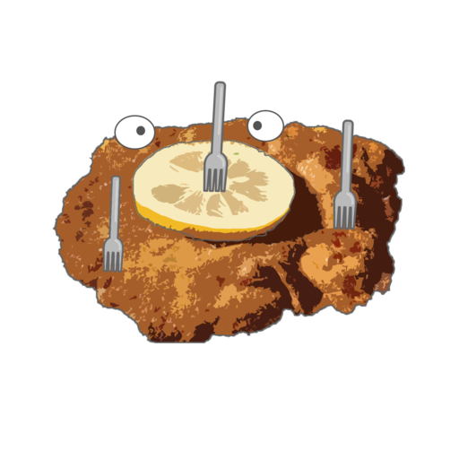

# Styleguide: SchnitzelRally
#### by Anna Seidl und Lena Ebner  

Find our styleguide [here ](https://ebnerlena.github.io/styleguide_vschitzeljagd.github.io/index.html)  

## Intro
### What is this project about?
**SchnitzelRally** is an app with which you can create and plan a __scavenger hunt alias Schnitzeljagd__ together with others online and then carry it out in the real wilderness.   
Everyone who participates in the same route can create tasks and place them on the map and so link them to the real space with GPS coordinates.   
Tasks can be multiple-choice questions, a task formulated in text for the whole team, a quiz question or photo upload.   
__Similar to geocaching but wilder!__

### Target group
The app is for everyone who likes to go wild and outside and solve challenges with friends/collegues.
Also the app can be used for teambuilding events and in schools for alternative learning approaches.

This styleguide is mainly for the 2 developer of the **SchnitzelRally Team** to create and offer a set of ressources and rules for development purpose.

  
